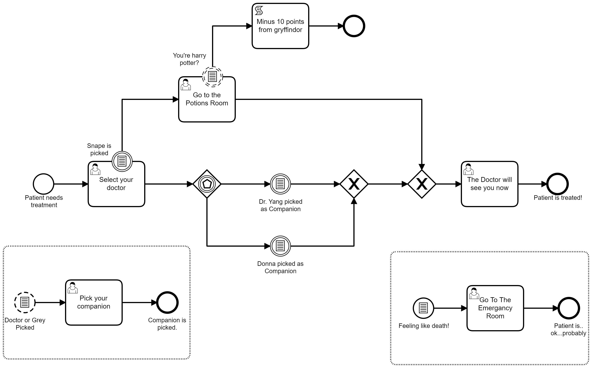
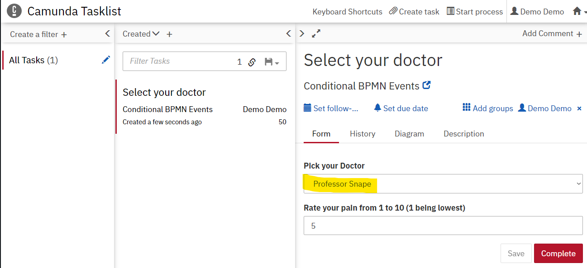
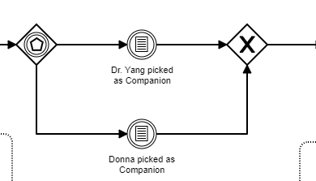
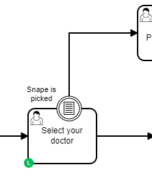
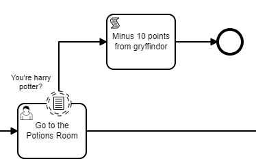
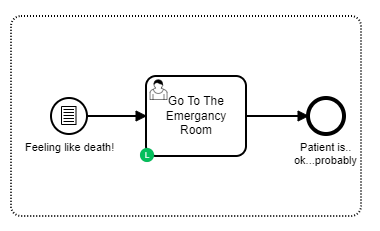
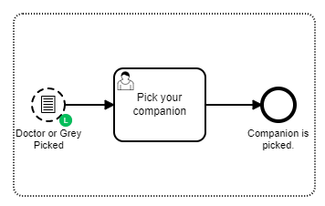

# Camunda Conditional Events Example
This example is a Spring Boot Application using [Camunda](http://docs.camunda.org).
In this example i'll show a variety of ways that [BPMN's Conditional Events](https://docs.camunda.org/manual/latest/reference/bpmn20/events/conditional-events/) can be used in your processes so that you can react dynamically to conditions that arrise in your model. 

## The Process
The [BPMN Process](src/main/resources/process.bpmn) in this example attempts to help a patient find the right fictional medical practitioner to help them with their pain.



At various point data entered by the user can trigger an event. For example if you pick Professor Snape from the selection of doctors and complete the task


the conditional boundary event on the task will trigger. This is because the front end will set the variable `doctor`with the value `snape`and the expression on the conditional event is:

```
#{doctor == 'snape'}
```

This will then send the process to `Go tot he Potoins Room` task.

## Different types of conditional events

There are lots of way of using conditional events in BPMN and in this example I demonstrate the following:

### Intermediate Conditional Event (with Gateway)


This is an example where the process is waiting at a certain point (the gateway) until one of the two events it's waiting for becomes true. Once any one of the events triggeres the process continues along that sequence flow. 

### Interrupting Conditional Boundary Event.


If this expression in this event is triggered it will interrupt the process and move the process will continue following the sequence flow leaving from the event. Feel free to read more about it [here in the docs](https://docs.camunda.org/manual/latest/reference/bpmn20/events/conditional-events/#conditional-boundary-event)

### Non-Interrupting Conditional Boundary Event

If the expression in this event is triggered the task will not be interrupted but a parallel token will flow to connected activity. This event has the potential to be triggered multiple times as long as the task is still active. Read more about it [here in the docs](https://docs.camunda.org/manual/latest/reference/bpmn20/events/conditional-events/#conditional-boundary-event)

### Interrupting Conditional Even Sub Process. 

This is an event that is active for the duration of the process instance and if at any point the condition on the event is met the process is interrupted (all other tokens will be cancelled) and the ``Go To The Emergancy Room`` task will become active. 

### Non-Interrupting Conditional Even Sub Process.

This is an event that is active for the duration of the process instance and if at any point the condition on the event is met a token is created in parallel to anything else going on in the process. This can be activated multiple times for each time the condition is met. 

## Have fun!
Have fun exploring how to trigger all the possible events. If you're really lucky you might be able to trigger a special case where Niall and his hawk will attempt to treat you in the emergency room :) 

## Running the application
You can also build and run the process application with Spring Boot.

#### Manually
1. Build the application using:

```bash
mvn clean package
```
2. Run the *.jar file from the `target` directory using:

```bash
java -jar target/Conditional-BPMN-Events.jar
```

For a faster 1-click (re-)deployment see the alternatives below.

#### Maven Spring Boot Plugin
1. Build and deploy the process application using:

```bash
mvn clean package spring-boot:run
```

#### Your Java IDE
1. Run the project as a Java application in your IDE using CamundaApplication as the main class.

### Run and Inspect with Tasklist and Cockpit
Once you deployed the application you can run it using
[Camunda Tasklist](http://docs.camunda.org/latest/guides/user-guide/#tasklist)
and inspect it using
[Camunda Cockpit](http://docs.camunda.org/latest/guides/user-guide/#cockpit).

## Environment Restrictions
Built and tested against Camunda Platform version 7.15.0.

## License
[Apache License, Version 2.0](http://www.apache.org/licenses/LICENSE-2.0).


